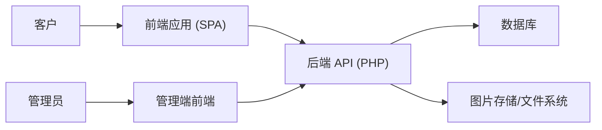
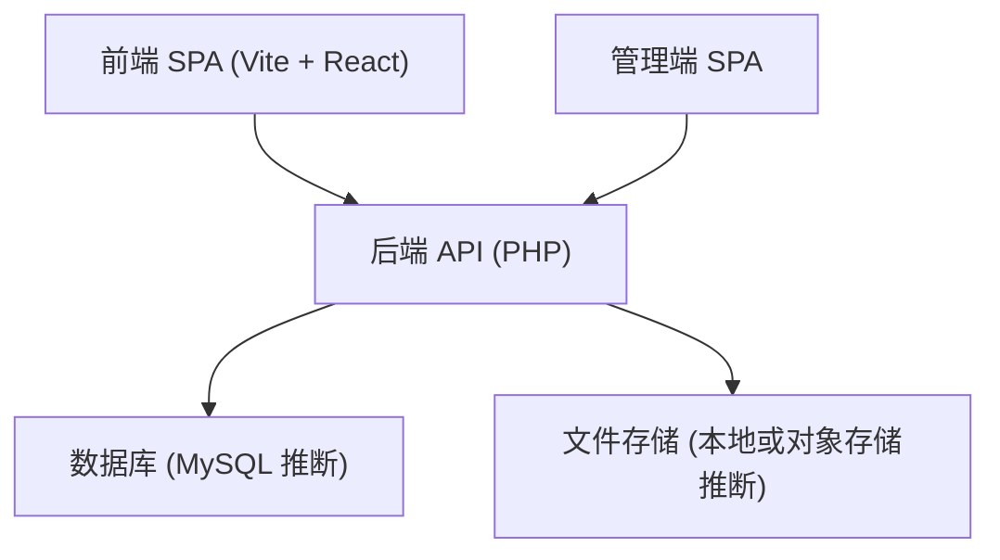
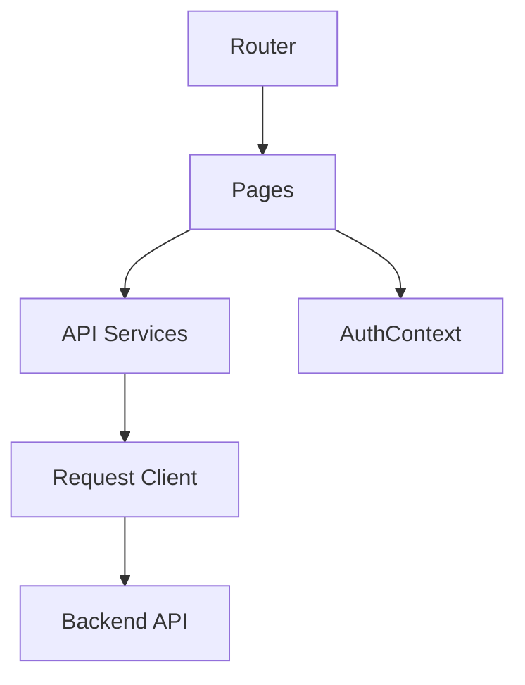

# C4 架构模型

以下为基于当前前端工程与 API 调用推断的系统设计视角文档。

## Level 1 – System Context
系统为“定制订单平台”，核心参与者为客户与管理员。

说明：
- 客户通过前端应用完成浏览、下单、上传、追踪。
- 管理员通过管理端登录后进入后台页面。
- 后端 API 负责业务逻辑与数据持久化。
- 图片由 API 统一写入并返回访问路径。

## Level 2 – Container Diagram

容器职责：
- 前端 SPA：路由、UI、调用 API。
- 管理端 SPA：登录后跳转后端管理页面。
- 后端 API：认证、订单、上传、进度管理。
- DB：持久化订单、用户、状态与关联。
- FS：订单图片与产品素材存储。

## Level 3 – Component Diagram（前端视角）

组件职责：
- Router：配置路由与布局边界。
- Pages：业务页面（分类、订单、认证）。
- API Services：领域服务封装。
- Request Client：统一错误处理与超时策略。
- AuthContext：认证状态共享。
