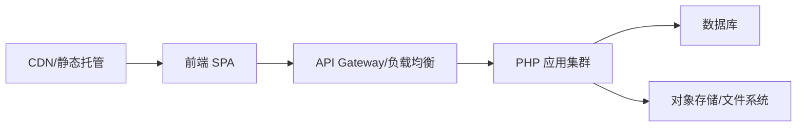

# 部署架构

## 生产部署视角

### 方案一：单机部署
```
Nginx
  ├─ 前端静态资源 (Vite build)
  └─ /api -> PHP-FPM
         └─ MySQL
         └─ 本地文件存储
```
优点：简单、成本低。  
缺点：扩展性弱、单点故障。

### 方案二：云上拆分部署
```
CDN -> 静态前端
API 网关 -> PHP 应用集群
数据库 -> RDS
对象存储 -> 图片/文件
```
优点：弹性伸缩、稳定性高。  
缺点：运维复杂度更高、成本更高。

## CDN 使用建议
- 图片与静态资源可走 CDN 缓存。
- API 保持短缓存或不缓存。

## 典型生产拓扑

