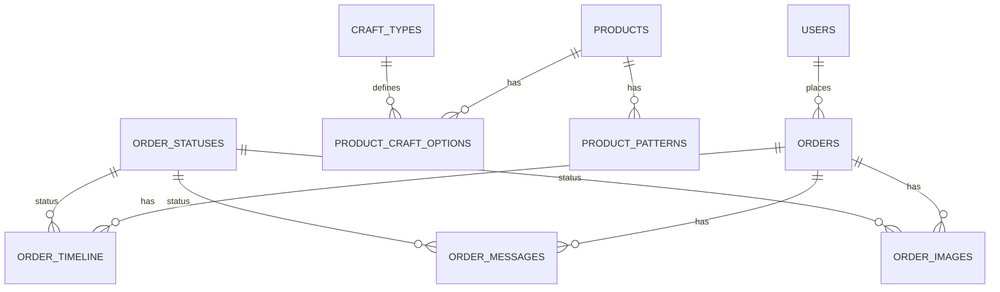

# ER 关系图（推断）

```mermaid
erDiagram
  USERS ||--o{ ORDERS : places
  PRODUCTS ||--o{ PRODUCT_CRAFT_OPTIONS : has
  PRODUCTS ||--o{ PRODUCT_PATTERNS : has
  CRAFT_TYPES ||--o{ PRODUCT_CRAFT_OPTIONS : defines
  ORDERS ||--o{ ORDER_TIMELINE : has
  ORDERS ||--o{ ORDER_MESSAGES : has
  ORDERS ||--o{ ORDER_IMAGES : has
  ORDER_STATUSES ||--o{ ORDER_TIMELINE : status
  ORDER_STATUSES ||--o{ ORDER_MESSAGES : status
  ORDER_STATUSES ||--o{ ORDER_IMAGES : status
```

## 关系说明
- 用户可创建多个订单。
- 产品与工艺有多对多关系（通过 product_craft_options）。
- 订单包含多个阶段、阶段消息与阶段图片。
- 订单阶段由状态表统一管理（可排序的流程状态）。
