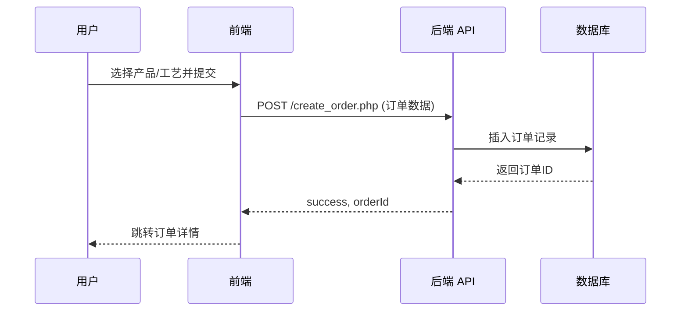
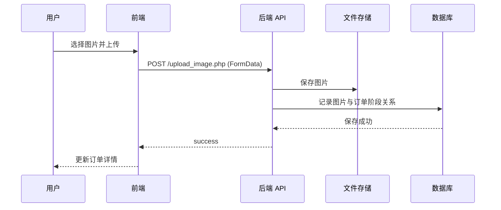
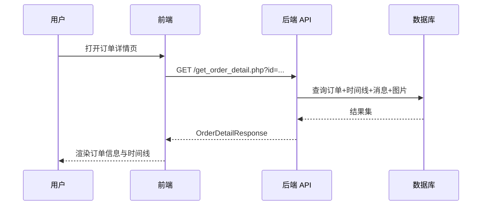

# 时序图

## 创建订单

```mermaid
sequenceDiagram
  participant U as 用户
  participant FE as 前端
  participant API as 后端 API
  participant DB as 数据库

  U->>FE: 选择产品/工艺并提交
  FE->>API: POST /create_order.php (订单数据)
  API->>DB: 插入订单记录
  DB-->>API: 返回订单ID
  API-->>FE: success, orderId
  FE-->>U: 跳转订单详情
```

## 上传图片

```mermaid
sequenceDiagram
  participant U as 用户
  participant FE as 前端
  participant API as 后端 API
  participant FS as 文件存储
  participant DB as 数据库

  U->>FE: 选择图片并上传
  FE->>API: POST /upload_image.php (FormData)
  API->>FS: 保存图片
  API->>DB: 记录图片与订单阶段关系
  DB-->>API: 保存成功
  API-->>FE: success
  FE-->>U: 更新订单详情
```

## 获取订单详情

```mermaid
sequenceDiagram
  participant U as 用户
  participant FE as 前端
  participant API as 后端 API
  participant DB as 数据库

  U->>FE: 打开订单详情页
  FE->>API: GET /get_order_detail.php?id=...
  API->>DB: 查询订单+时间线+消息+图片
  DB-->>API: 结果集
  API-->>FE: OrderDetailResponse
  FE-->>U: 渲染订单信息与时间线
```
