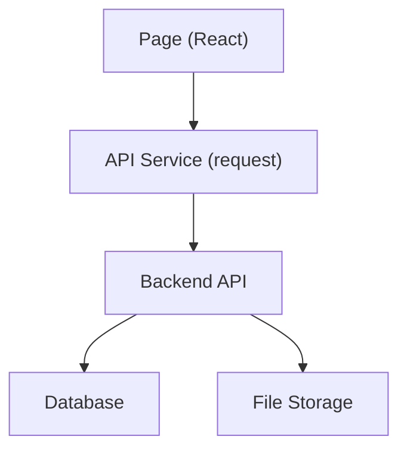

# 架构分析

## 项目结构概览
- `src/`：主站前端源码
  - `pages/`：页面级组件
  - `components/`：复用组件
  - `layout/`：布局组件
  - `routes/`：路由入口
  - `context/`：全局状态（认证）
  - `api/`：统一 API 调用层（新增）
  - `styles/`：样式
- `public/`：静态资源与站点文件
- `hearth-admin/`：独立管理端前端

## 前端架构
- 单页应用（React + Vite）。
- 路由集中在 `src/routes/AppRouter.jsx`，分为主站布局与认证布局。
- 页面通过 `fetch` 或 API service 获取数据并渲染。
- 认证状态通过 `AuthContext` 与 `localStorage` 维护。

## 后端架构（推断）
- PHP 端点位于 `/api/hearthstudio/v1`。
  - 认证：登录、注册、邮箱验证、密码重置
  - 订单：创建订单、订单看板、订单详情、订单阶段沟通
  - 上传：图片上传
- 管理端登录后跳转到后端 PHP 页面进行订单管理。

## API 层
新增统一请求封装 `src/api/client.js`，并按领域拆分：
- `authService.js`
- `orderService.js`
- `uploadService.js`

## 状态管理
仅使用 React 内部状态与 `AuthContext`。
缺少全局缓存策略（如 React Query），数据多为页面内请求、页面内状态管理。

## 图片上传机制
前端用 `FormData` 上传到 `/upload_image.php`，后端保存并返回结果。
图片展示使用完整 URL 拼接规则或后端返回的路径。

## 外部服务
推断为自有域名 `ichessgeek.com`，同时作为图片与 API 访问域。

## 组件与通信关系

## 典型请求流
1. 浏览器加载页面。
2. 页面 `useEffect` 触发 API 调用。
3. API 返回 JSON，页面更新 state。
4. UI 渲染列表、详情或进度。
