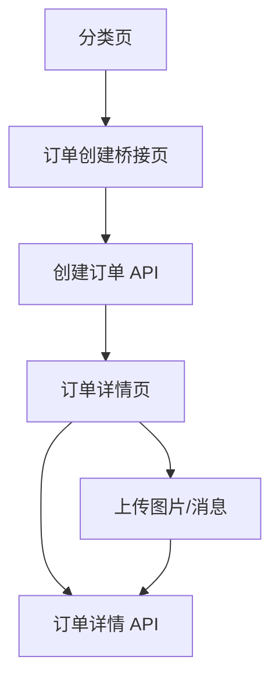

# 前端工作流

## 页面结构与路由
路由集中在 `src/routes/AppRouter.jsx`，分为主站布局与认证布局。
主要页面：
- 首页/分类：产品与工艺浏览
- 桥接页：订单创建前配置
- 订单详情：进度与沟通
- 认证相关：登录、注册、验证、重置密码

## API 服务层
新增 `src/api/` 作为统一请求入口：
- `client.js` 统一处理错误、超时与 JSON 解析
- `authService.js` 封装账号相关接口
- `orderService.js` 封装订单与产品接口
- `uploadService.js` 封装上传接口

## 状态更新与渲染
页面使用 `useState` 保存本地数据，`useEffect` 拉取 API 数据并触发渲染。
认证状态通过 `AuthContext` 与 `localStorage` 同步。

## 订单数据从 API 到 UI 的流动
1. 分类页拉取产品工艺列表。
2. 用户选择工艺进入桥接页。
3. 桥接页提交订单创建并跳转详情页。
4. 详情页加载订单信息与时间线。
5. 用户上传图片/发送消息后刷新订单详情。

