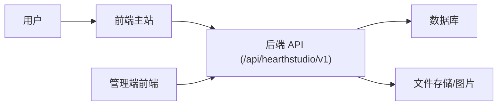

# 系统概览

## 系统做什么
该系统是一个定制工艺品电商/工作室平台，支持用户浏览产品与工艺、提交定制订单、上传参考图片并跟踪订单进度。系统还包含一个独立的管理端入口，用于进入后台管理页面。

## 用户是谁
- 客户（访客/注册用户）：浏览产品、下单、提交定制信息、上传图片、跟踪订单进度。
- 工作室/管理员：通过管理端登录后进入后端管理页面处理订单。

## 解决的问题
为定制化产品提供在线下单与进度协作路径，降低沟通成本，形成可追踪的订单生命周期管理流程。

## 核心特性
- 产品与工艺分类浏览
- 订单创建与配置（交期、刻字、公开性、备注）
- 订单进度时间线与消息沟通
- 图片上传（客户/工作室）
- 邮箱注册/验证/密码找回流程

## 主要组件
- 前端主站（React + Vite）
- 管理端前端（独立入口，登录后跳转后端 PHP）
- 后端 API（PHP 风格端点，路径 /api/hearthstudio/v1）
- 数据库存储（推断：用户、订单、订单阶段、图片等）
- 文件存储（图片上传与访问）

## 高层架构说明
前端单页应用通过 `fetch` 调用后端 API，后端完成业务逻辑与数据持久化；图片上传通过表单上传 API，并由后端保存到文件系统或对象存储。

### 交互关系

### User / Frontend / API / Database / File Storage
- User：浏览、下单、上传、查询。
- Frontend：路由、页面渲染、状态管理、调用 API。
- API：认证、订单、上传、进度维护。
- Database：持久化用户、订单、进度与关系。
- File Storage：保存上传图片与产品图。
